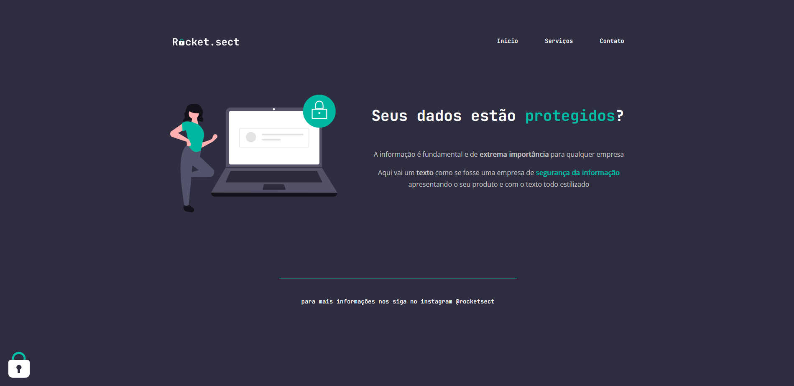

<h1 align="center"> Rocket.sect </h1>

  <a href="#-tecnologias">Tecnologias</a>&nbsp;&nbsp;&nbsp;|&nbsp;&nbsp;&nbsp;
  <a href="#-projeto">Projeto</a>&nbsp;&nbsp;&nbsp;|&nbsp;&nbsp;&nbsp;
  <a href="#-layout">Layout</a>

 

  

## 🚀 Tecnologias

Esse projeto foi desenvolvido com as seguintes tecnologias:

- HTML e CSS
- Git e Github

## 💻 Projeto

Esta landing page foi desenvolvida em um desafio do Stage 02 do curso Explorer da Rocketseat. O desafio era replicar de maneira autonoma o design contido no Figma.

Você pode visualizar o projeto através [DESSE LINK](https://viviansanchez.github.io/rocketseat-explorer-stage02-desafio04/)!

## 🔖 Layout

Você pode visualizar o layout do projeto através [DESSE LINK](<https://www.figma.com/file/7o4Socp2dRVSaDF76hc5Xa/Explorer-(Copy)?node-id=0%3A1>). É necessário ter conta no [Figma](https://figma.com) para acessá-lo.
